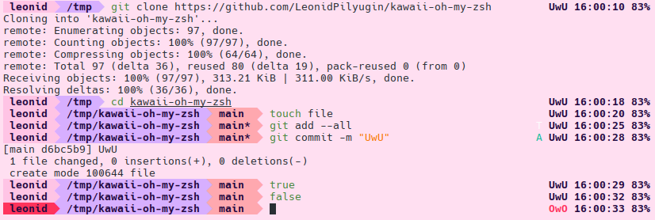

# kawaii-oh-my-zsh
Kawaii oh-my-zsh theme.
Has terminal and virtual console modes.

Git info:
* A (ADD) -- added
* M (MDF) -- modified
* D (DLT) -- deleted
* R (RNM) -- renamed
* G (UMG) -- unmerged
* T (UTK) -- untracked

## Screenshots
Terminal mode:

Terminal mode with git repo:

Virtual console mode:

